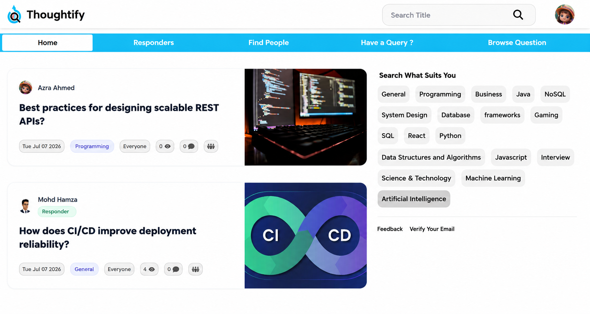
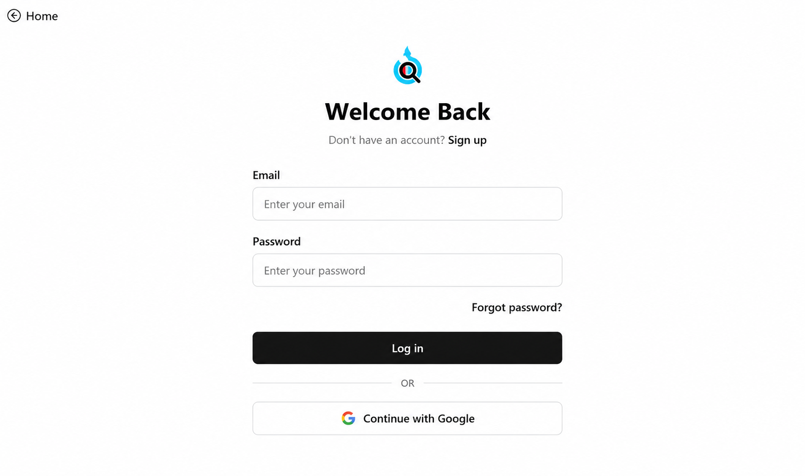
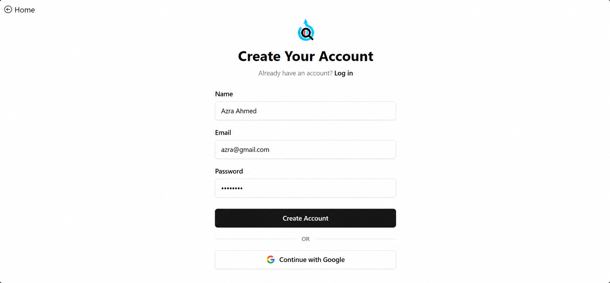
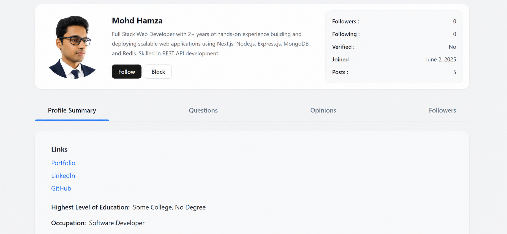
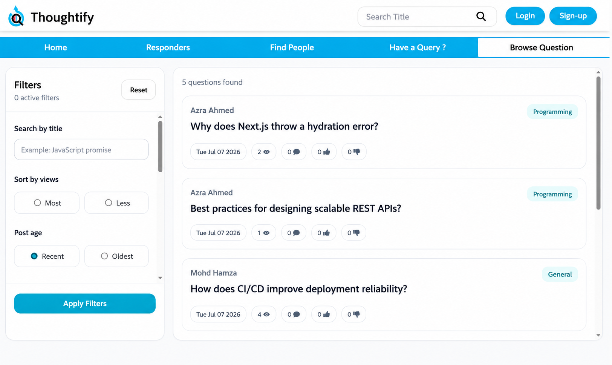
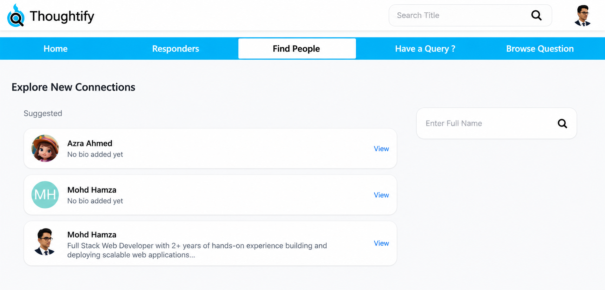

# Thoughtify - Community Driven Q&A Platform

## Overview

Thoughtify is a modern Question & Answer platform where users can share knowledge, ask questions, interact with posts, and build communities around topics of interest.

The application enables users to create posts, participate in discussions through comments and replies, follow other users, receive notifications, and manage their profiles. It is built using React and Appwrite, leveraging Appwrite's backend services for authentication, database management, storage, and user management.

---

## Live Demo

[https://thoughtify.vercel.app/]

---

## Features

### Authentication & User Management

* User registration and login
* Google Authentication
* Email verification
* Forgot password functionality
* Profile management

### Post Management

* Create, edit, and delete posts
* Upload thumbnails
* Categorize posts
* Infinite scrolling feed
* View tracking

### Community Engagement

* Like and dislike posts
* Bookmark posts
* Follow and unfollow users
* Block users

### Discussion System

* Post comments
* Nested replies (sub-comments)
* Poll support within posts

### Discovery

* Search users
* Filter posts by category
* Profile-specific post filtering
* Responders section

### Notifications

* Activity notifications for user interactions

### Progressive Web App

* Installable PWA experience
* Mobile-friendly interface

---

## Tech Stack

### Frontend

* React.js
* Vite
* Tailwind CSS
* React Router

### Backend Services

* Appwrite Authentication
* Appwrite Database
* Appwrite Storage
* Appwrite Functions (if used)

---

## Application Architecture

```text
React Application
        │
        ▼
     Appwrite
 ┌─────────────┐
 │ Authentication │
 │ Database       │
 │ Storage        │
 └─────────────┘
```

---

## Key Technical Implementations

### Infinite Scroll

Implemented lazy loading and pagination to improve user experience and reduce unnecessary data fetching.

### Nested Comment System

Built a hierarchical commenting structure allowing users to participate in threaded discussions.

### User Relationship Management

Implemented follow, unfollow, and block functionality to support community interactions.

### Notification System

Created a notification workflow to keep users informed about relevant activities.

### Progressive Web App

Configured the application as a PWA for improved accessibility and installation across devices.

---

## Future Improvements

* Real-time notifications
* Real-time messaging
* Advanced search capabilities
* Content moderation tools
* Admin dashboard
* Analytics and insights

---

## Local Setup

### Clone Repository

```bash
git clone <repository-url>
```

### Install Dependencies

```bash
npm install
```

### Environment Variables

Create a `.env` file and add:

```env
VITE_APPWRITE_URL = ""
VITE_APPWRITE_DATABASE_ID = ""
VITE_APPWRITE_PROJECT_ID = ""
VITE_APPWRITE_BUCKET_ID = ""
VITE_APPWRITE_COLLECTION_ID = ""
VITE_APPWRITE_NEWCOLLECTION_ID = ""
VITE_APPWRITE_PROFILECOLLECTION_ID = ""
VITE_APPWRITE_BUCKET_ID_THUMBNAIL = ""
VITE_APPWRITE_FEEDBACK_COLLECTION_ID = ''
VITE_APPWRITE_NOTIFICATION_COLLECTION_ID = ''
UNSPLASH_API_KEY = ""
VITE_TINYMCE_API = ""
VITE_FIREBASE_API_KEY = ""
VITE_FIREBASE_AUTH_DOMAIN = ""
VITE_FIREBASE_PROJECT_ID = ""
VITE_FIREBASE_STORAGE_BUCKET_ID = ""
VITE_FIREBASE_MESSAGING_SENDER_ID = ""
VITE_FIREBASE_APPID = ""
 
```

### Run Development Server

```bash
npm run dev
```

---

## 📸 Screenshots

### 🏠 Home Page

<p align="center">
  
</p>

---

### 🔐 Login

<p align="center">
  
</p>

---

### 📝 Sign Up

<p align="center">
  
</p>

---

### 👤 User Profile

<p align="center">
  
</p>

---

### 🔍 Search Users

<p align="center">
  
</p>

---

### 🤝 Connections

<p align="center">
  
</p>
---

## Author

Mohd Hamza

Frontend Developer | React Developer

GitHub: [https://github.com/Mohd-Hamza-123]
LinkedIn: [https://www.linkedin.com/in/mohd-hamza-18959427a/]
